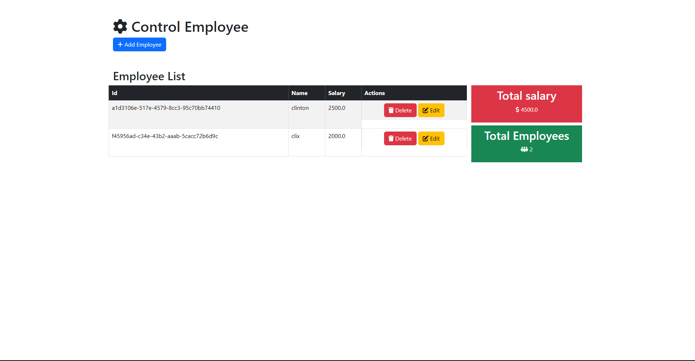

# Crud Customer | Clientes
-   es un proyecto de CRUD de clientes, donde se puede crear, leer, actualizar y eliminar clientes.
-    también muestra el total de clientes registrados  y el total de saldo de todos los clientes.
## Tecnologías
- java
- spring boot
- Thymeleaf
- bootstrap
- maven
- postgresql

